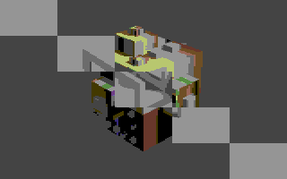

# Koala copy-paste.

### Input source image

### Input destination image

### Result image

# Usage:

~~~
# application takes 8 arguments

> koala.py src_img.kla dst_img.kla src_x src_y width height dst_x dst_y

# src_image	-- path to source image with "kla" extension
# dst_image	-- path to destination image with "kla" extension

# src_x 	-- range( 0, 39 )
# dst_x 	-- range( 0, 39 )
# width		-- range( 0, 39 )

# src_y		-- range( 0, 24 )
# height	-- range( 0, 24 )
# dst_y		-- range( 0, 24 )

# i.e.

> python3 koala.py image_to_copy_from.kla imag_to_copy_to.kla 16 0 8 5 16 10
~~~

For destination image name "dst_img.kla" application will create
output name like this: "img_to_copy_to result.kla"

